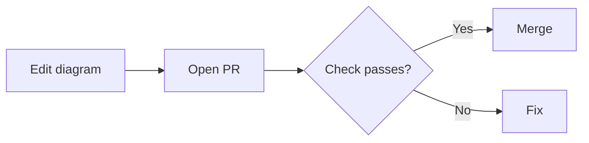

# mermaid-cli-examples

Examples of checking and rendering Mermaid diagrams with Mermaid CLI (`mmdc`) on GitHub Actions.

## Review flow



## Data flow

```mermaid
flowchart LR
    A[Browser --> B[API]
```
